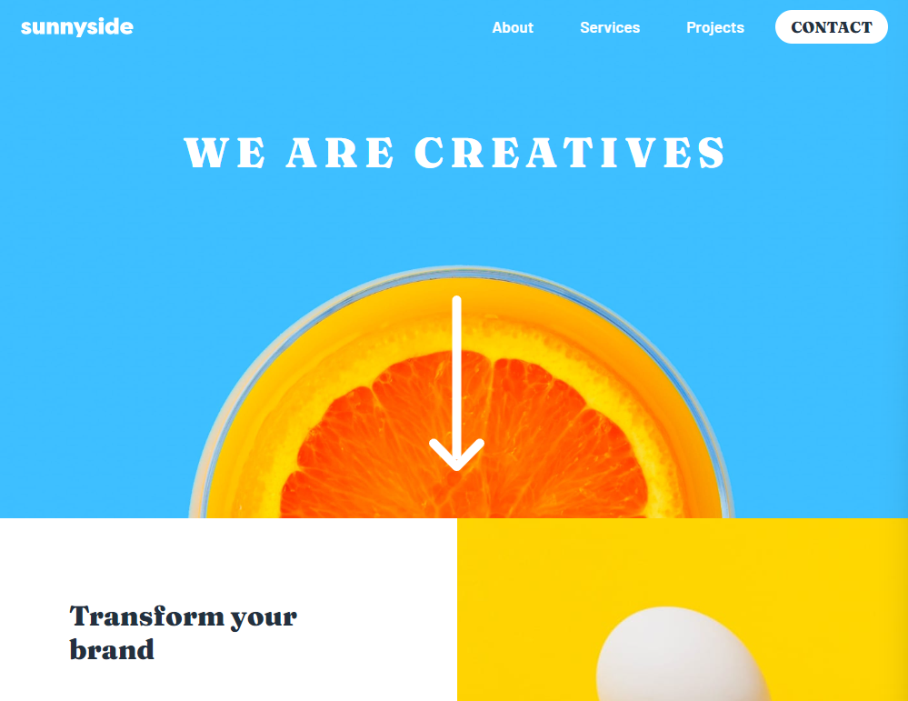
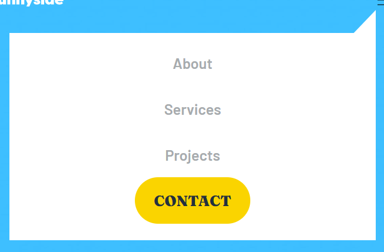

# Sunnyside Agency Landing Page


This is a solution to the [Sunnyside agency landing page challenge on Frontend Mentor](https://www.frontendmentor.io/challenges/sunnyside-agency-landing-page-7yVs3B6ef).

## Table of contents

- [Overview](#overview)
  - [Links](#links)
  - [Built with](#built-with)
- [My process](#my-process)
- [Author](#author)

---

## Overview





### Links

- Solution URL: [Add solution URL here](https://your-solution-url.com)
- Live Site URL: [Add live site URL here](https://your-live-site-url.com)

### Built with

- Semantic HTML5 markup
- Flexbox
- CSS Grid
- Sass
- Javascript
---

## My process

My goal with this challenge was to become more comfortable with Sass; in particular with organizing Sass modules into separate files. Now that the project is over, I don't think I can ever go back to writing normal CSS!

My style structure looks like this: 

```
/scss

	/components
    	_footer.scss
    	_hero.scss
    	_index.scss // forwards
    	_mobile.scss
    	_nav.scss
    	_reset.scss // CSS reset by Josh Comeau
    	_sections.scss

	/variables
    	_colors.scss
		_fonts.scss
		_index.scss // forwards
		_math.scss 

	index.scss // main file
```

In the components directory, I separated my files into different parts of the site (ie. nav, hero, footer). The variables directory contained colors, fonts, and basic sizing information.

Finally, my main index.scss file was relatively empty, just containing references to the components and variables:

```
@use './variables/' as *;
@use './components/' as *;
```

In a future refactor, I may separate the mobile file into its own components as well. It got quite long by the end of the project! I found this structure fairly easy to work with, and it was nice being able to easily find the styles I was looking for.

To get the mobile navbar to work, I used CSS clip-path to create the shape of the menu:



```
clip-path: polygon(0 10%, 94% 10%, 100% 0%, 100% 100%, 0 100%);
```

Some javascript was needed to add the "show" and "hide" classes which were used for animations. 

```
hamburger.addEventListener('click', () => {
	ul.classList.toggle('show');
	ul.classList.toggle('hide');
	const isVisible = ul.classList.contains('show');

	if (isVisible) {
		document.addEventListener('click', e => {
			if (!document.querySelector('.nav').contains(e.target) && e.target !== hamburger) {
				ul.classList.remove('show');
				ul.classList.add('hide');
			}
		});

		lis.forEach(li => {
			li.addEventListener('click', () => {
				ul.classList.remove('show');
				ul.classList.add('hide');
			});
		});
	}
});
```

The animations were done using very simple CSS (which could have been made even more simple using transitions rather than animations, but hindsight...): 

```
.show {
	display: flex;
	animation: slide-down 1000ms forwards;
}
.hide {
	display: flex;
	animation: slide-up 1000ms forwards;
}
@keyframes slide-down {
	0% {
		transform: scale(0);
		transform-origin: top right;
    }
	100% {
		transform: scale(1);
		transform-origin: top right;
	}
}

@keyframes slide-up {
	0% {
		transform: scale(1);
		transform-origin: top right;
	}
	100% {
		transform: scale(0);
		transform-origin: top right;
	}
}
```

The main problem I ran into here was that the "hide" animation would run every time the page would load or refresh, which I solved by adding a preload class to remove animations. A setTimeout function removes this class and allows for animations to continue as normal.

```
setTimeout(function() {
	ul.classList.remove('preload');
}, 1000);
```

I also decided to make the navbar sticky, and in doing so created the need for a background color for contrast. This was not specified in the design, but it follows the color scheme and allows for the text to be legible. 

Javascript was used to add this background color only when the user scrolls past the hero section:

```
window.addEventListener('scroll', () => {
	let scrolled = window.scrollY;

	if (scrolled <= heroHeight) {
		navbar.classList.remove('scrolled');
	} else {
		navbar.classList.add('scrolled');
	}
});
```

Finally, to make sure things continued working as expected even if a user resized their browser window, I added an event listener to check for resizes and adjust as needed:

```
window.addEventListener('resize', () => {
	heroHeight = hero.clientHeight - 5;
	ul.classList.add('preload');
	setTimeout(function() {
		ul.classList.remove('preload');
	}, 1000);
});
```
---

## Author

- Website - [Danielle Lyle](https://itsdani.me)
- Frontend Mentor - [@souperstition](https://www.frontendmentor.io/profile/souperstition)